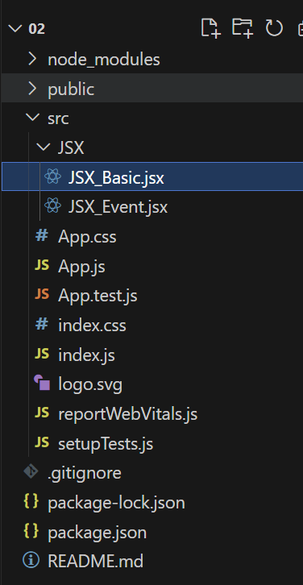
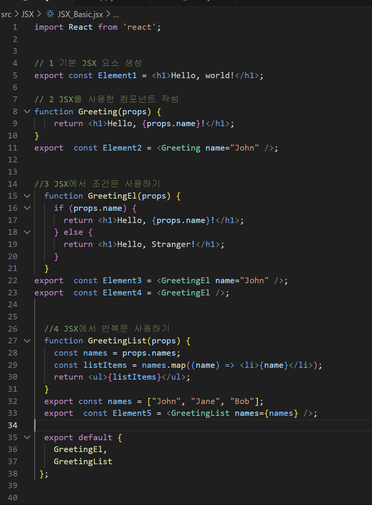
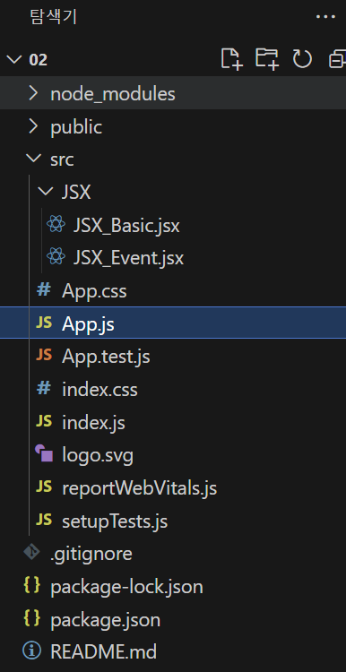
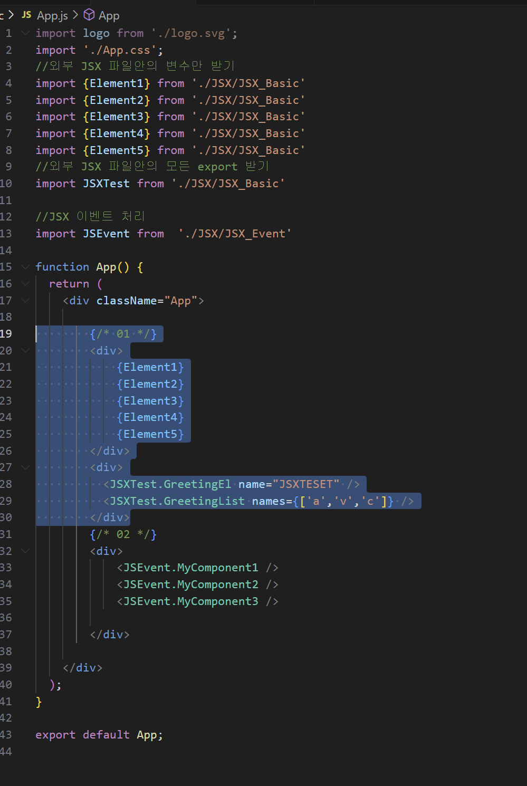
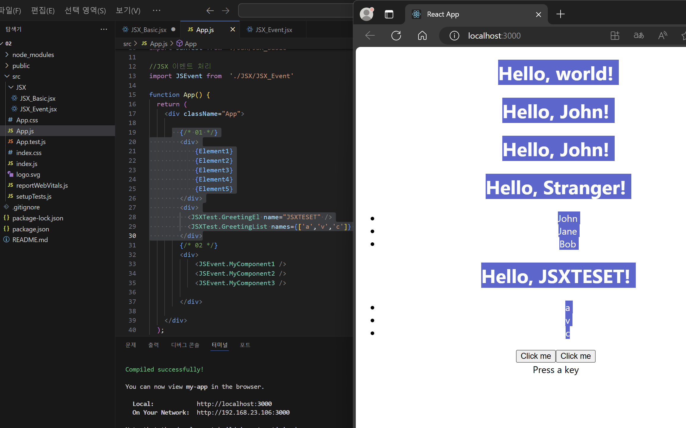
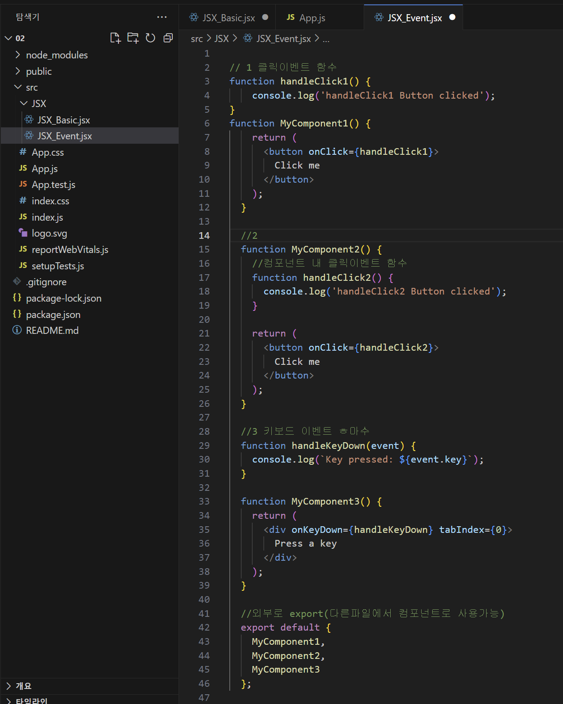
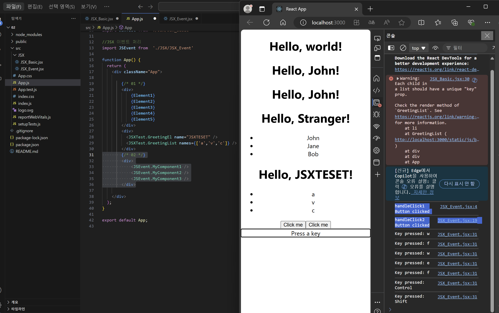

# REACT JSX

|참고|
|-|
|[JSX 개요](https://ko.legacy.reactjs.org/docs/introducing-jsx.html)|
|[JSX](https://goddaehee.tistory.com/296)|
|[JSX 문법 정리](https://velog.io/@brgndy/%EB%A6%AC%EC%95%A1%ED%8A%B8-JSX-%EB%AC%B8%EB%B2%95-%EC%A0%95%EB%A6%AC)|

 
JSX 기본
---
> JSX란
```
JSX는 JavaScript에 XML을 추가한 확장 문법이다.
React에서 컴포넌트를 만드는데 유용하게 사용된다.

예시 : 
const element = <h1>Hello, world!</h1>;

위에 태그 문법은 문자열도, HTML도아닌 JSX(JavaScript XML)라는 JavaScript에 XML을 추가하여 확장한 문법이다.
JSX는 React “엘리먼트(element)” 를 생성한다. React 엘리먼트는 브라우저 DOM 엘리먼트와 달리 일반 객체이다.
React는 JSX 사용이 필수가 아니지만, JS 코드 안에서 UI관련 작업을 할 수 있기 때문에 시각적으로 더 도움이 된다.
또한 JSX를 사용하면 React가 더욱 도움이 되는 에러 및 경고 메시지를 표시할 수 있게 해준다.

JSX 문법을 사용해서 코드를 작성후 동작시키면 브라우저에서 실행 되기전에 바벨이 '자바스크립트 형태'로 변환을 시켜준다.
```

JSX 문법 정리
---
>1. JSX에서는 class가 아닌 className을 사용한다.<br>
[오류]
```

import './App.css';

function App() {
  return (
    <div class="App">          //x
      <div class='black-nav'>  //x
        <h4>블로그</h4>
      </div>
    </div>
  );
}
export default App;
```
[정상]
```
import './App.css';

function App() {
  return (
    <div className="App">
      <div className='black-nav'>
        <h4>블로그</h4>
      </div>
    </div>
  );
}
export default App;

```

> 2. JSX에서는 변수를 사용할 때, {}를 사용한다.<br>
```
import './App.css';

function App() {

  let post = '블로그 글 제목';  //변수지정

  return (
    <div className="App">
      <div className='black-nav'>
        <h4>블로그</h4>
      </div>
      <h4> {post} </h4> //변수적용
    </div>
  );
}

export default App;
```
> 3. HTML안에 스타일 지정할 때는 style = {{ style} }
```
import './App.css';

function App() {

  let post = '블로그 글 제목';

  return (
    <div className="App">
      <div className='black-nav'>
        <h4 style= { {color : 'red', fontSize : '16px'} }>블로그</h4>
      </div>
      <h4>{ post }</h4>
    </div>
  );
}

export default App;
```
[주의]
```
style = { } 안에 { }로 한번 더 감싸주어서 지정할 스타일들을 작성해야한다.
안에 스타일 내용들은 객체형으로 key : value 형태로 작성해야한다.
HTML에서는 폰트사이즈를 font-size 였지만, 자바스크립트에서는 font (마이너스) size로 인식하므로 붙여서 fontSize로 작성해야한다.
```

> 4. 하나의 div 태그로 감싸주어야한다.<br>

[오류]
```
mport './App.css';

function App() {

  let post = '블로그 글 제목';

  return (
      
      <div className='black-nav'>  //x - 상위태그 부재
        <h4 style= { {color : 'red', fontSize : '16px'} }>블로그</h4> //x - 상위태그 부재
      </div> //x - 상위태그 부재
      <h4>{ post }</h4> //x - 상위태그 부재
  );
}

export default App;
```
[정상]
```
mport './App.css';

function App() {

  let post = '블로그 글 제목';

  return (
      <> //상위태그 형성
      <div className='black-nav'>  
        <h4 style= { {color : 'red', fontSize : '16px'} }>블로그</h4> 
      </div> 
      <h4>{ post }</h4> 
      </>
  );
}

export default App;
```


실습－１기본
---
|파이트리|코드|
|-|-|
|||
|||

|결과|
|-|
||

실습－２이벤트 처리
---

|-|
|-|
||
||


